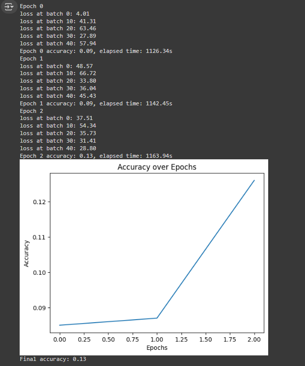

### 正確答案

The exact result of np.dot() function:
~~~python
[[ 27.110546 -32.6854  ]
 [ 31.966581 -37.74659 ]]
~~~

### 篩選答案(im=0)

### p = 0

Sieve function approximate result:
~~~python
[[ 27.11086  -33.33285 ]
 [ 31.966902 -38.41066 ]]
~~~

### p = 5

Sieve function approximate result:
~~~python
[[ 27.11086  -33.33285 ]
 [ 31.966902 -38.41066 ]]
~~~

### p = 10

Sieve function approximate result:
~~~python
[[ 27.11086  -33.33285 ]
 [ 31.966902 -38.41066 ]]
~~~

### 篩選答案(im=1)

### p = 0

Sieve function approximate result:
~~~python
[[ 27.11086  -33.33285 ]
 [ 31.966902 -38.41066 ]]
~~~

### p = 5

Sieve function approximate result:
~~~python
[[ 27.11086  -33.33285 ]
 [ 31.966902 -38.41066 ]]
~~~

### p = 10

Sieve function approximate result:
~~~python
[[ 27.11086  -33.33285 ]
 [ 31.966902 -38.41066 ]]
~~~

### 下面的狀況

當篩選當輸出還為0時，輸出的exponent會為-127，所以sivingThreshold會很小，那就導致，
**至少一定會有一個輸入會與權重的第一個為1的位元相乘累加到輸出!!
這是使用輸出的exponent來決定sivingThreshold必然會出現的狀況!**
~~~python
X_approx(im=0, r=36): 
[[15.770698  0.      ]
 [ 0.        0.      ]]

X_approx(im=1, r=36): 
[[16.416462   3.0285978]
 [ 7.210342   2.1343133]]

-----------------------------------------
X_approx(im=0, r=37): 
[[0. 0.]
 [0. 0.]]

X_approx(im=1, r=37): 
[[16.416462   3.0285978]
 [ 4.958589   2.1343133]]
~~~

### colab實驗紀錄

#### MNIST dataset big NN

* 想要深究SiviingNet是否有問題的程式碼，把NN縮小也把data量縮小
  * 對照組: NaiveDense_with_SiviingNet_controlgroup_debug.ipynb
  * TCB實驗組: NaiveDense_with_SiviingNet_debug.ipynb
  * noTCB實驗組: NaiveDense_with_SiviingNet_remove_TBC_debug.ipynb

* 正常大小NN以及正常data量
  * 對照組: Sieving_network_NaiveSequential_MNIST.ipynb
  * TCB實驗組: Sieving_network_NaiveSequential_MNIST_TCB.ipynb(裡面含有紀錄每一層exponent分佈程式)
  * noTCB實驗組: NaiveDense_with_SiviingNet_remove_TBC.ipynb

#### IRIS dataset small NN

random.seed(44)不錯，且大概ephoch=6000就行

* NN4x10x3Softmax_Iris.ipynb
  * Iris最原始訓練程式碼
  * 取出原始訓練成功後的權重
  * 加進SievingNet
  * 自己手寫一層一層的加進SievingNet_NN(裡面包括測驗各種不同r+exponent分佈)
* NN4x10x3Softmax_Iris_learning_loop.ipynb
  * 進入會紀錄省下加減法計算次數
  * 