# 實驗方向

把SievingNet放進一個DNN内，並且做訓練，紀錄省下計算的次數(這邊有兩種，一種是因為權重此位元為0所以省下來的，另一種是因為輸入exponent太小被過濾下來的，理論上這一部分才是我們的功勞)，和原本總計算次數相除，就能得知省下計算的次數。

把SievingNet做成硬體，一次做兩個向量內積，向量長度隨便，使用stream一次傳入兩個node(一個A的一個W的)還有目前篩檢閥值大小，SievingNet硬體做相乘。看輸出是否正確，並且查看硬體使用多寡。

## 探討

* 一般GPU如何設計
* Strassen 演算法──分治矩陣乘法
* 稀疏矩陣

## 下次實驗

* ~~把"Siveve_layer_numpy_硬體邏輯版本.py"完成~~
* ~~exponent函式完成~~
* ~~把Siveve_layer_numpy_完全平行版本.py與權重十進制轉成二進制程式合併並驗証正確~~
* ~~把"Siveve_layer_numpy_硬體邏輯版本.py"改成由Bit篩選~~
* ~~完成BCB2TCB~~
* ~~float_to_fixed_point_binary.py加進BTC(binary_ternary_converter)~~
* 做辨識MNIST神經網路的每層輸入exponent分佈圖
* 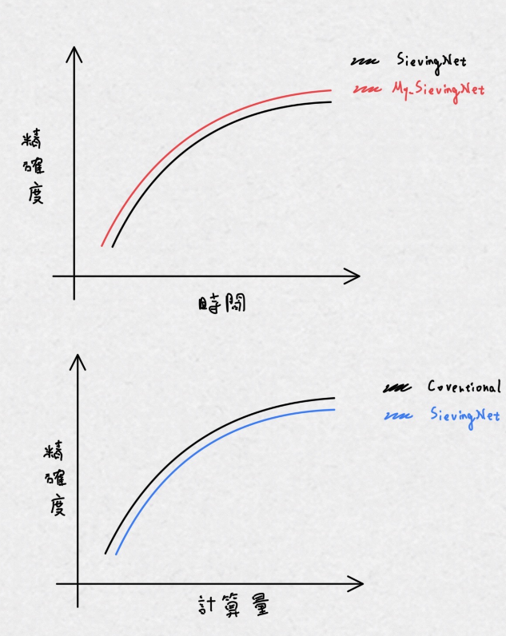
* Sieve演算法應該變成，現在輸出exponent大小到-126距離加上32再跟im相乘
* 輸入資料應該做Normalization

## 新發現

1. 假設兩向量$A=[7, 8, 9], B=[a, b, c]$內積$Answer=7a + 8b +9c$，SievingNet篩選時應該同時檢視$7a + 8b +9c$三項element，逐位元篩選，像是這邊的例子就是$(0111)_2*a + (1000)_2*b + (1001)_2*c$，會先查看最高位元(分別是$0，1，1$)進行累加後再查看次高位元(分別是$1，0，0$)，如此時間複雜度就由Weight的位元寬度決定為常數，所以時間複雜度為O(1)。但如果篩選時選則逐項篩檢減，先篩檢7a再8b最後9c，將會導致時間複雜度由兩項量長度決定，時間複雜度O(n)
2. 權重轉TCB的話一定會有所誤差損失
3. **自動化**: 人工制定好規則告訴機器後機器開始處理事情 **智慧化**: 機器從資料中學習後機器開始處理事情
4. 發現Batch Normalization和layer normalization對於NN内data範圍不會有影響，只是資料分佈中心點會在0而已，帶來的好處是error surface比較平緩，比較好做梯度下降。
5. 輸入的exponent分佈圖長怎麼樣不重要，重要的是知道重要數據通常會很集中。
6. 新篩選閥值決定方式$SievingThreshold = exponent(S)+ CER+ (32-k)$
   1. $CER = cover exponent range = im * (exponent(S)-(-127)) , 0≤im≤1$
3. "Approximate Computing for Batch Learning in Neural Network"這一篇論文是使用直接截斷Weight部份低位元來達到近似計算，過程不需用排序且運算可以平行化;而SievingNet方法為了使用「目前累加輸出」的大小來過濾掉某些對輸出影響不大的輸入達到節省運算成本，必須「循序逐項累加並比較大小」無法平行化，因此會consume大量時間。
4. 使用「前一次」輸出結果的大小來過濾掉某些對輸出影響不大的輸入達到節省運算成本，雖然節省的計算成本比前者較少，但卻能大大改進需要消耗大量時間的問題。
5. 做實驗時，做驗証又或是測試時，可以使用傳統向前傳播方法，這樣可以省下大量時間。
6. 如果訓練完推論時不篩選正確率可能會大幅下降，所以訓練完必須pruning，但這種方法可能在前面的人論文就有發表過。
   1. 可以有創新點的地方是，在訓練時，比較大小的閥值可以適應性調整。
   2. pruning是對權重，但是我們Sieving是對輸入資料
7. 調整CER的方式好像可以再改進，例如每一次更新im大小不要採用固定的，而是變化性的。
8. RMSprop(Root Mean Square Propagation)，代表的意思是考慮一直以來的gradient的大小，來調整現在gradient的大小。
9. Momentum考慮的事，一直以來的gradient的大小及方向，來調整現在gradient的方向及大小(別忘記gradient是一個向量)。
10. Learning Rate，代表每次移動的大膽程度。一開始先warm up，是因為還不清楚現在周邊的情勢，所以一開始不能太大這樣。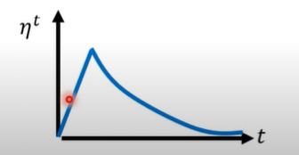
11. im(Acceptance rate)，代表對外界事物接收的程度。一開始先warm up，是因為還不清楚現在周邊的情勢，所以一開始不能太小這樣。
12. 會有overfitting的問題，根本上是因為訓練集資料跟測試集資料有mismatch，比喻來說就是模擬考考的東西跟實際真正考試考的東西不一樣!
    1.  在不動資料集的情況之下，只能調整讓自己的model不要過於overfit訓練集資料，譬喻來說也就是不要過於專注在模擬考上的錯誤。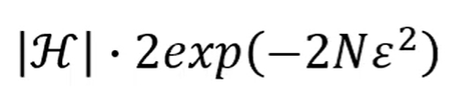
13. 每一筆資料的loss function都不一樣，但與其他資料集一樣的是他們的最低點都在差不多的位置。
14. 小一點的batch帶來的好處是，有點noisy可以讓你不會卡在一個無法學習的點上，或是一個不太好的local minima上(不太好的定義就是峽谷比較窄)，譬喻起來就像是追一部劇比起一次看完，跟播的話你和別人討論的時候總是能記得更多東西。
15. im_delta 設置的大小非常重要，目前知道在MNIST資料集上每個ephoch 0.1附近不錯，在IRIS資料集上每10個epoch0.01不錯。
16. SievingNet之下訓練完的model，在Sievework狀況下測試成績更好哈哈!
17. SievingNet一開始篩選率是不是不應該那麼高?
18. life-long learning就是探討如何我們才不會忘記
19. Trnsfer learning是探討我們可不可以利用現有的技能更容易學新技能

## 實驗紀錄

1. weight在二進制的位元數必須多給1bit，**確保數值轉換為二進位時首位元為0**，因為在Bianary coded轉Ternary coded時可能會多出1bit。
   * 舉個例子: W 範圍在[-3, 3]，則整數位元(int_bits)必須至少要3bits以上。(2bits的數值範圍是[-3, 3]，但要再加一bit，所以等於3bits)
2.Batch size = 32時的學習曲線圖 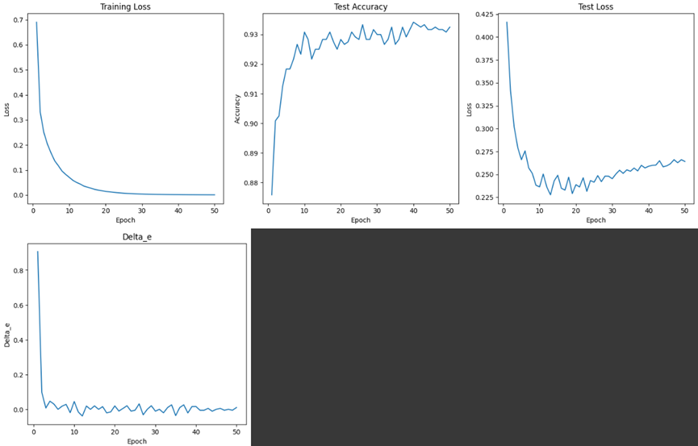不知道為什麼testing時loss會變那麼大
3. 我印象孟州上課講的時候他是說batch size越大越好，因為一次訓練看越多東西條一次參數這樣比較準確。 但最近我看了別的老師的教學則是說小一點的batch size雖然可能會有"noisy"問題，但卻能剛好起到對抗overfiiting的問題，讓模型泛化性比較好。但我自己訓練的時候卻發現小一點的batch size好像有overfiiting的問題，有趣了!

## 實驗困難

1. 不知道很多trning的tips，一開始總是亂tran一發，之後看了很多學習教材，和影片，學習了很多深驚網路訓練的技術，例如feature normalization、better optimization、adaptive learning rate...
2. MNIST的資料分佈對我們很有力所以實驗結果才很漂亮，目前可以有進展的是做單一個感知器的速度。

### 文獻探討

* normalization是否有幫助我們sieve
* [一顆比較器的功耗與速度](https://reurl.cc/0dOXzK)
* [降低功耗的方法-Medium](https://reurl.cc/bYR3NX)
* [寄存器、锁存器和触发器傻傻分不清？](https://www.eet-china.com/mp/a108800.html)
* 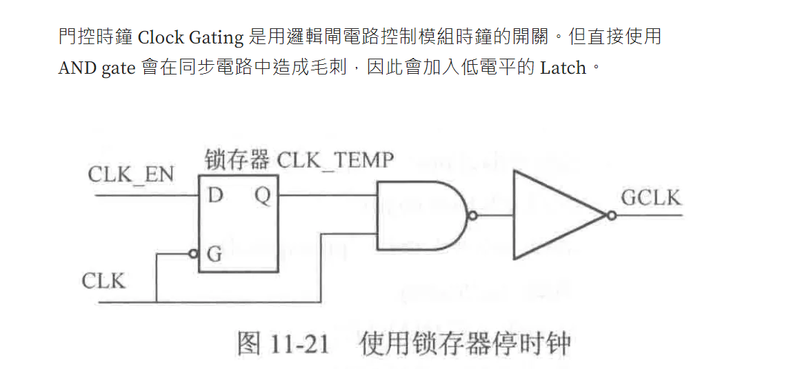
* [參考文獻格式產生器](https://wordvice.com.tw/citation-guide/mla)

### 參考網頁

* [比较CPU和GPU中的矩阵计算-CSDN](https://blog.csdn.net/qq_42722197/article/details/135664062)
* [用conda建立及管理python虛擬環境](https://reurl.cc/70GZDQ)
* [AlphaTensor: 用增強式學習找出更有效率的矩陣相乘演算法-李弘毅](https://youtube.com/watch?v=KPcA8QCTm5U)
* [MatMul的現況討論-fb](https://reurl.cc/OMNO1r)
* [進位儲存加法器設計-蕭宇宏](https://reurl.cc/ZekmQQ)
* [Design a Binary Multiplier Circuit-ALL ABOUT ELECTRONICS](https://reurl.cc/6vm806)
* [乘法器的優化-鐵人賽](https://reurl.cc/OMNZdR)
* [施特拉森演算法-wiki](https://reurl.cc/70xaY5)
* [Carry Save Multiplier-NPTEL](https://reurl.cc/ZekKDp)
* [🚀 Numba JIT 是什麼 Numba是一個開源的JIT（即時編譯）編譯器，通過使用LLVM將Python子集翻譯成快速的機器碼，從而提供在CPU和GPU上並行執行Python代碼的選項。它為包括許多NumPy函式在內的數值計算提供了加速。](https://www.nvidia.cn/glossary/data-science/numba/)
* [一文通透想颠覆Transformer的Mamba：从SSM、HiPPO、S4到Mamba](https://blog.csdn.net/v_JULY_v/article/details/134923301)
* [淺談圖像生成模型 Diffusion Model 原理](https://reurl.cc/OMWOQD)
* [資料庫管理](https://www.youtube.com/watch?v=Ppod0sNKxSY)
* [backbone、head、neck等深度学习中的术语解释](https://blog.csdn.net/t20134297/article/details/105745566)
* [HLS：矩阵乘法单元设计与SDK测试](https://blog.csdn.net/mmphhh/article/details/115535951)
* [蒐集資料與訓練模型時會發生的常見問題 & 解決方式 + 新手也能懂得AI-深入淺出的AI課程系列](https://ithelp.ithome.com.tw/articles/10302523)
* [Tensorflow、Keras傻瓜式安裝教學](https://reurl.cc/Gj8zjd)
* [2022 FALL 機器學習網站 - 吳沛遠](https://ntueemlta2022.github.io/)
* [李宏毅_基礎線性代數](https://reurl.cc/mMVG8Y)
* [李宏毅_基礎線性代數_版本](https://reurl.cc/p3z1Y4)
* [Tensor playground](https://reurl.cc/kOR123)
* [Iris 資料集-Medium(有花的圖片)](https://reurl.cc/Wx5WL9)
* [TinyML and Efficient Deep Learning Computing-MIT](https://hanlab.mit.edu/courses/2023-fall-65940)
* [止Google Colab自动断开代码-github](https://gist.github.com/e96031413/80a633f6a07c150b431639a4e3c606a8)
* [止Google Colab自动断开代码集清除方法-CSDN](https://blog.csdn.net/jinniulema/article/details/128994223)
* [Model Pruning深度解析-ZOMI醬(講的不是很好，有時候會亂唬爛)](https://www.youtube.com/watch?v=nB0nAb8pE4I)
* [学习分享一年，对神经网络的理解全都在这40分钟里了](https://www.youtube.com/watch?v=pnkCEzwiSog)
* [記憶體內運算-電腦與通訊科普網站](https://reurl.cc/Dl1Y8E)
* [Computing in Memory/Sensor技術與應用-工研院產業學習網](https://reurl.cc/xvDe84)
* [What is In-Memory Computing?-IBM(給了一個簡單的例子解釋)](https://www.youtube.com/watch?v=BTnr8z-ePR4)
* [類神經網路剪枝與大樂透假說-李宏毅(有最好剪枝方法的論文連結)](https://www.youtube.com/watch?v=utk3EnAUh-g)
* [基因演算法-秒懂c++](https://www.youtube.com/watch?v=F00ZOPVftjM)
* [在論文中使用pseudo code-CSDN](https://reurl.cc/935Gya)
* [論文繪圖軟體分享-CSDN](https://reurl.cc/adNRLY)
* [word插入Endnote参考文献报错{***, 1995 #307}解决方案-CSDN](https://reurl.cc/KlpxZp)

### 探索知識點

* 優化器(optimizer)
  * SGD和adam
* 現在大型語言模型能如何做到多模態的，例如影像辨識不是用CNN最好嗎?如何單用一個架構去做多種不同事情
* [克服CNN不能invarient to scaling和rotation](https://youtu.be/SoCywZ1hZak?si=eKmtJIxqAiAtT0wd)
* 生成式神經網路
* [AI芯片](https://www.youtube.com/watch?v=A5od8T1ryNY&list=PLuufbYGcg3p6AJnWPcHvdKWCq_TelF5LA)
* [和澄科技 Haley Technology](https://www.haleytech.com/en/homepage/110)
* [基於FPGA的深度學習推論取得突破](https://www.eettaiwan.com/20181126ta01-breakthrough-in-fpga-based-deep-learning-inference/)
* [神經網路硬體合成-台大電機江介宏](http://atp.ee.ncku.edu.tw/classview_92.html)
* [軟硬體協同設計之人工智慧晶片設計-逢甲陳冠宏](http://atp.ee.ncku.edu.tw/classview_219.html)
* GPU的乘法單元設計
* 矩陣乘法演算法
* 螢幕總是黏灰層
* 最佳打電腦的姿勢
* bias調整方式是否跟weight一樣?
* 為什麼不能使用地毯式搜索loss function最低點?
* 使用gradient decent方式，四周高起中間凹陷的global minima要怎麼找到?
* [有趣的個人AI網站](https://leemeng.tw/index.html#home)
* 

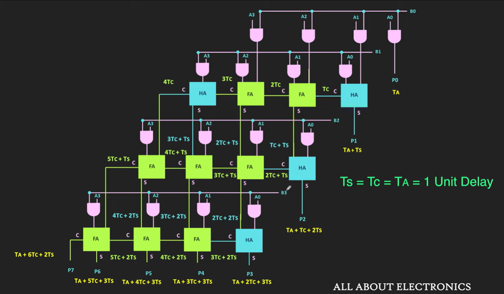
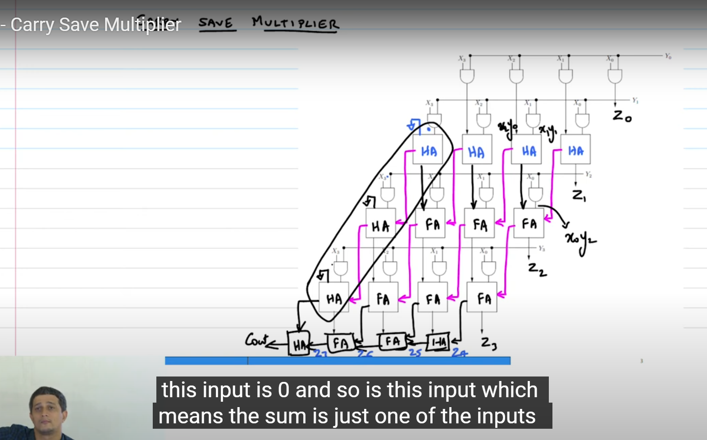

## Meeting問題

1. SievingNet演算法在篩檢的時候需要循序篩檢，雖然說可以省下一些移位和加法計算，但比起傳統方法因為還多了篩選步驟不就應該會更耗時，為什麼論文中可以得出這一張圖?
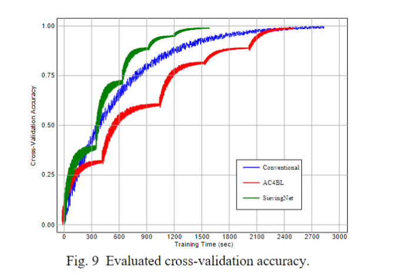
1. 移位相加與乘法相比，在時間、面積和功耗上分別誰具有優勢?

### 海報問題

1. Sieving這一個方法是只有運用在訓練階段還是推論階段也會使用，意思是，推論階段時會篩選嗎?(會，不過篩選率使用者可以自己根據需求調高或調低)
2. 為什麼Sieving這一個方法可以省下real-time。
3. 為什麼叫做 AC4BL(Batch Learning)

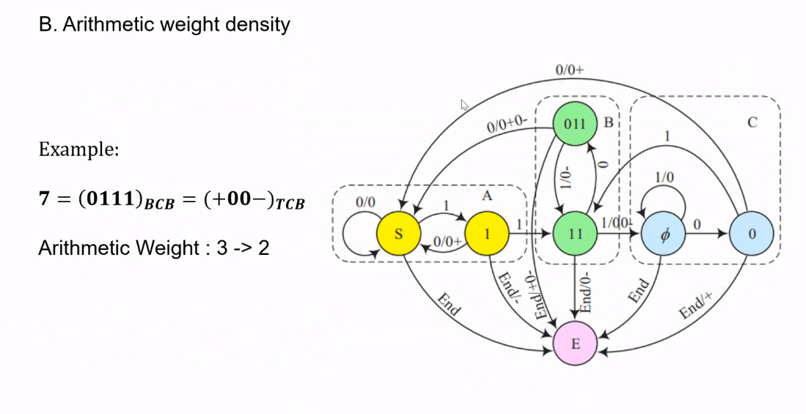

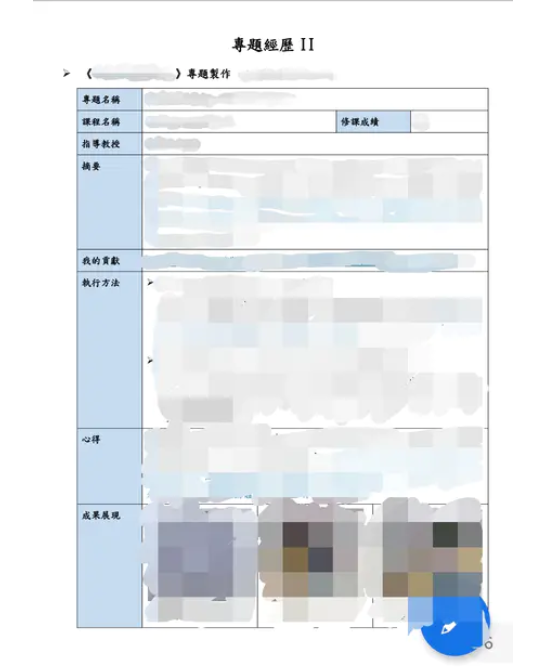

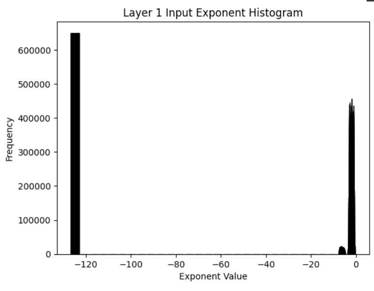
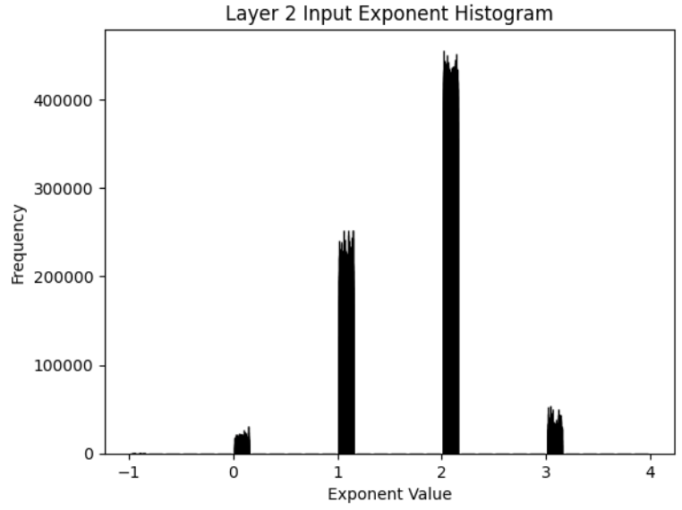
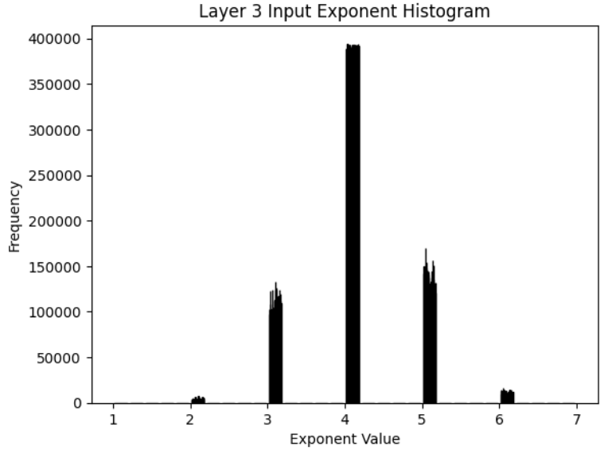

### 每層輸入exponent分佈圖

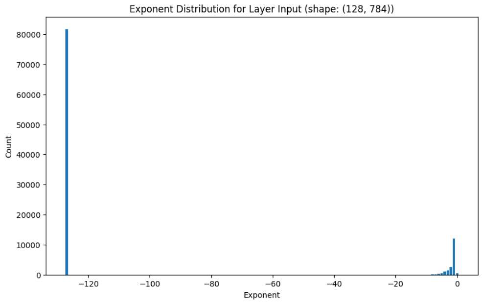
Exponent distribution for Layer Input (shape: (128, 784)):
Exponent -127: 81729
Exponent -8: 43
Exponent -7: 167
Exponent -6: 380
Exponent -5: 590
Exponent -4: 1008
Exponent -3: 1412
Exponent -2: 2500
Exponent -1: 12003
Exponent 0: 520
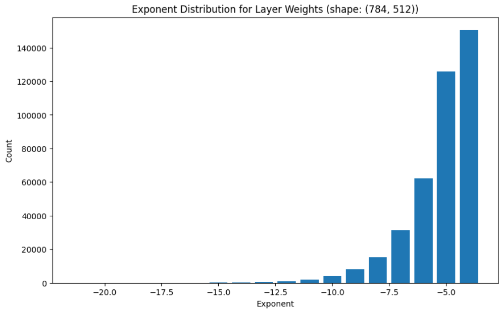
Exponent distribution for Layer Weights (shape: (784, 512)):
Exponent -21: 3
Exponent -20: 8
Exponent -19: 8
Exponent -18: 15
Exponent -17: 22
Exponent -16: 62
Exponent -15: 115
Exponent -14: 234
Exponent -13: 525
Exponent -12: 946
Exponent -11: 2043
Exponent -10: 3897
Exponent -9: 7973
Exponent -8: 15463
Exponent -7: 31419
Exponent -6: 62298
Exponent -5: 125824
Exponent -4: 150553
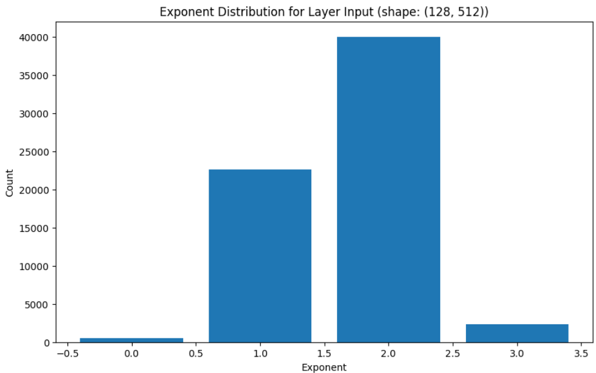
Exponent distribution for Layer Input (shape: (128, 512)):
Exponent 0: 541
Exponent 1: 22597
Exponent 2: 40050
Exponent 3: 2348
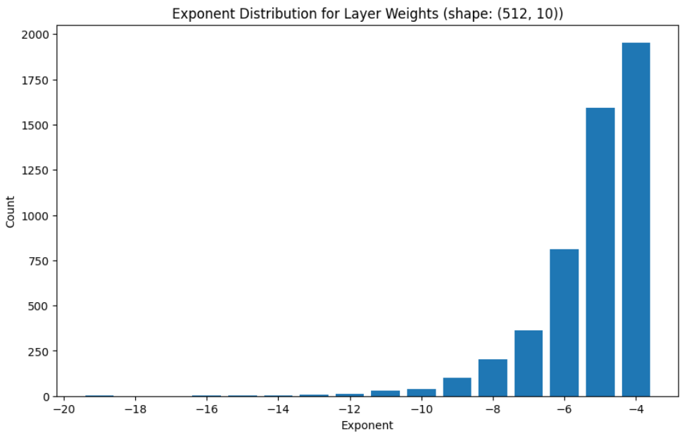
Exponent distribution for Layer Weights (shape: (512, 10)):
Exponent -19: 1
Exponent -16: 1
Exponent -15: 1
Exponent -14: 3
Exponent -13: 8
Exponent -12: 13
Exponent -11: 31
Exponent -10: 38
Exponent -9: 103
Exponent -8: 202
Exponent -7: 361
Exponent -6: 811
Exponent -5: 1593
Exponent -4: 1954

#### 下次實驗
